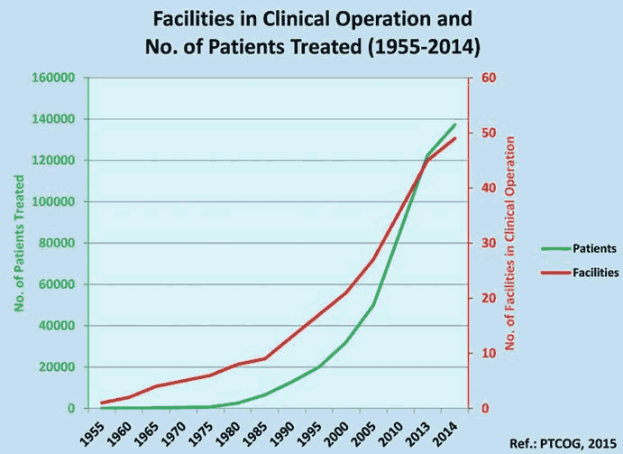

# `A.09.0` Dosimetry for Proton Beam Therapy

## Objective

In conjunction with the medical community, develop protocols and techniques to
be used to assess absorbed dose from high energy proton beams.

## Actions

- [ ] In collaboration with proton beam cancer treatment centers, NIST and the
ADCL’s should harmonize protocols for proton beam dose determinations. This will
involve a selection of appropriate dosimeters for use in a clinical environment
and studies amongst the existing proton beam treatment center as to the
inter-center precision of such dosimeter systems.

## Requirements

- [ ] A minimum of 2 person-years per year over the next three year time period
is required to launch into these objectives. Partnerships between NIST, ADCL’s
and the medical community are essential in this area.

## Background

A major advance in the beam treatment of cancers has been the development and
adoption by the medical community of high energy proton beams (200+ MeV). While
such beams are very expensive installations, the ability to focus proton beams
on smaller domains of cancerous tissue has resulted in more efficacious patient
treatment by minimizing potential radiation exposure to adjacent healthy tissue.
Unlike electron beams or photon beams from isotopes or X-ray sources, proton
beams do not attenuate as the distance from the source increases. Proton beams
generate a Bragg peak concentrating the ionizing radiation at a distance from
the source which is dependent upon the proton beam energy, as illustrated in
Figure 1.

> 
>
> **Figure 1** Comparison of percent depth dose curves (PDDs) between different
radiation therapy treatment modalities. Image reproduced with permission from
Wayne Newhauser's 2016 CIRMS Annual Meeting presentation.

The number of proton therapy centers has been increasing in the US, which
increases the need for standardization of dosimetry in clinical protocols. The
trend in proton therapy centers is shown in Figure 2.

> 
>
> **Figure 2** Trend of proton therapy centers in the US. and cumulative
patients treated since 1955.
