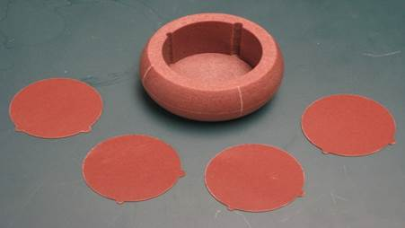

# `A.17.0` 3D Dosimeters for Non-Standard External Beam Therapy Dosimetry

## Background

With the advent of sophisticated radiation therapy treatment fields, there is an
increased need for 3D dosimeters to verify the treatment delivery process. For
many years, radiation therapy was comprised mostly of open fields and relatively
little beam modulation. As Intensity Modulated Radiation Therapy (IMRT),
Stereotactic Radiosurgery (SRS), and more recently Volumetric Modulated Arc
Therapy (VMAT) treatment plans are deliverable with commercial accelerator
platforms, verifying the accuracy and deliverability of each platform has become
a complicated process. Point-based dosimeters (such as ion chambers) and planar
dosimeters (such as film) have been widely available for years. 3D dosimeters
are not as widely available and are difficult to characterize. New formulations
of gel / plastic dosimeters have shown promise to measure accurately the doses
in non-standard external beam therapy dosimetry.

> 
>
> **Figure 2** Example of a 3D dosimeter comprised of a cavity designed to hold
a stack of self-developing radiochromic film designed by Travis McCaw
