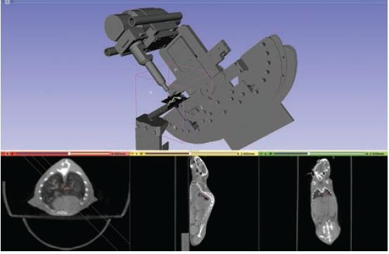

# `A.19.0` Standardization in Radiobiology

## Objective

**Establish dosimetry standards for use in x-ray and radionuclide-based radiation
biology programs.**

## Actions

- [ ] With cooperation between NIST, AAPM, AACR, and the NIH, standard
measurement techniques need to be established through the use of
standard operating procedures (SOPs) and dosimetry equipment
validation. The measurement techniques must include NIST-traceability
and appropriate primary standard development / utilization.

## Requirements

- [ ] Undetermined dollar amount - Partnerships between NIST, AAPM, AACR,
and the medical community are essential in this area.

## Background

With the increasing accuracy in radiation therapy and radiation biology
techniques, the accuracy of clinical radiation therapy dosimetry has far
outpaced the accuracy in radiobiology laboratories. Recent advances include the
introduction of highly sophisticated small-field preclinical irradiators such as
the irradiator shown in Figure 1. Field sizes as narrow as 0.5 mm in diameter
are being implemented for small-animal biology studies. It has been shown that
doses delivered in radiation biology laboratories are being delivered with
inaccuracies of up to 50% and sometimes more. Typical radiobiology irradiators
include radionuclide-based systems (Cs-137 or Co-60) and x-ray based cabinet
irradiators. Standard measurement protocols do not exist for either of these
systems and users are assuming the nominal dose rates are accurate.

Evidence shows that the presumed doses delivered in radiation biology
irradiators are not in agreement with the auditing doses measured by experienced
radiation therapy dosimetry labs. Additionally, the articles being published do
not report adequate details to reproduce the experiments performed.

With better accuracy in radiation biology experiments, applications of this
would reach into other specialities such as radiation protection, homeland
security, and the industry.

> 
>
> **Figure 1** Schematic of the XSTRAHL SAARP irradiator platform (image obtained
from Xstrahl.com).

